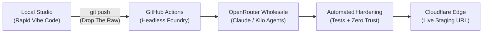

# drop-the-raw

> **Unfiltered vibe code in. Mastered production software out.**  
> *The autonomous software delivery pipeline replacing $200/mo copilot seat subscriptions with headless wholesale intelligence.*

---

## What is `drop-the-raw`?

Most builders use AI backwards: they pay $20–$200/month per seat to sit in a chat box, copying terminal stack traces, arguing with hallucinations, and babysitting broken imports.

**`drop-the-raw` flips the paradigm.**

You build fast and messy in your local sandbox. You don't worry about edge runtime bindings, strict typing, or test coverage. When you're ready, you **drop the raw** with `git push`. 

In the cloud, an autonomous engineering crew on GitHub Actions picks up the commit, refactors the code, writes automated BDD test suites, hardens zero-trust edge security, and deploys directly to Cloudflare Staging—running on pure pay-as-you-go wholesale API tokens via OpenRouter.

---

## The Two-Tier Workflow

| Stage | Where It Runs | What Happens |
| :--- | :--- | :--- |
| **Tier 1: Creative Studio** | Local (`npm run dev`) | Instant visual iteration, rough prototypes, rapid experimentation. Zero CLI friction. |
| **Tier 2: Headless Foundry** | Remote (GitHub Actions) | Headless autonomous coders refactor dirty code, generate tests, block AI crawlers, configure Cloudflare edge bindings, and deploy. |

---

## Features

- **Zero User CLI**: No terminal babysitting. The pipeline runs autonomously.
- **Pure Wholesale Economics**: No recurring per-seat SaaS bills. You pay wholesale token rates via OpenRouter (typically pennies per feature).
- **Edge Native**: First-class support for Cloudflare Workers, Pages, D1 SQL, KV, and Wrangler.
- **AI Scraping Protection**: Pre-configured WAF rules, Turnstile bot detection, and `robots.txt` scraper blocks out of the box.

---

## Quickstart (1-Click Fork)

1. **Fork this repository** to your GitHub account (`Awesaum/drop-the-raw`).
2. Add your secrets under **Settings > Secrets and variables > Actions**:
   - `OPENROUTER_API_KEY`: Wholesale model access.
   - `CLOUDFLARE_API_TOKEN`: Edge deployments.
3. Start coding locally. When satisfied with a prototype, commit and **drop the raw**.

---

## About & Newsletter

`drop-the-raw` is an open-source architecture by **Drew Saum** and the flagship starter kit for **[Artificial Unintelligence](https://company.help)**—the weekly newsletter breaking down how to replace human IT labor and legacy software development with autonomous headless systems.
