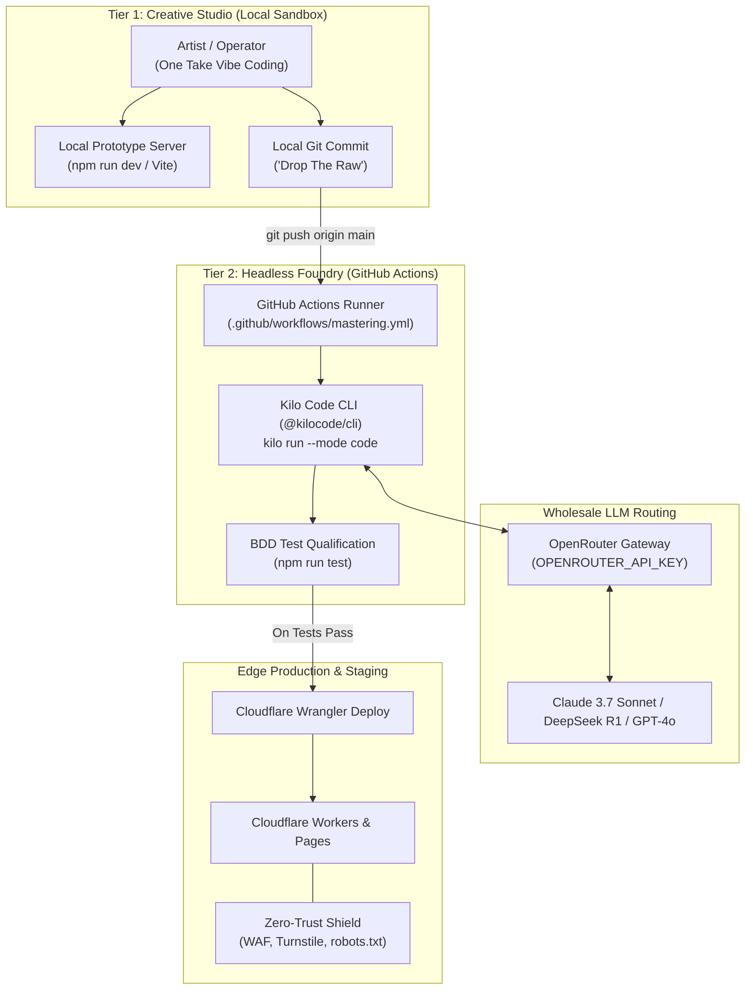

# SPECIFICATION: drop-the-raw

> **The Autonomous Headless Foundry: From One-Take Vibe Code to Enterprise Edge**

---

## 1. Executive Summary & Objective
- **Problem**: Builders waste hours babysitting chat windows, wrestling with hallucinations, and paying $20–$200/mo per seat for copilot subscriptions. Meanwhile, vibe-coded prototypes break instantly in production due to lack of tests, missing edge bindings, and zero-trust security flaws.
- **Solution**: `drop-the-raw` decouples the creative prototyping phase from engineering qualification. The operator freely hacks raw prototypes locally ("One Take" KozarKane ethos). On `git push`, GitHub Actions invokes **Kilo Code CLI** (`@kilocode/cli`) headlessly via OpenRouter wholesale tokens. Kilo refactors the code, generates BDD tests, enforces Zero Trust (robots.txt, WAF, Turnstile), and deploys to Cloudflare Edge.
- **Target Audience**: Solopreneurs, IT leaders, and subscribers of the **Artificial Unintelligence** newsletter by Drew Saum.
- **Guardrails**: Zero User CLI. Zero local database setup. No monthly SaaS seats. Strict workspace credential isolation.

---

## 2. Architecture & Service Topology



---

## 3. Configuration & Environment Bindings

### 3.1 Repository Secrets (GitHub Actions)
| Secret Name | Required By | Description |
| :--- | :--- | :--- |
| `OPENROUTER_API_KEY` | Kilo Code CLI | Wholesale model access without per-seat markup. |
| `CLOUDFLARE_API_TOKEN` | Wrangler Action | Edge deployment token for Workers/Pages. |
| `CLOUDFLARE_ACCOUNT_ID` | Wrangler Action | Target Cloudflare account identifier. |
| `GITHUB_TOKEN` | Automated Commits | Built-in GitHub Actions token for pushing mastered code. |

### 3.2 Workspace Local Secrets (`.env` — Git Ignored)
- `GITHUB_TOKEN`: Workspace-isolated PAT for autonomous git operations.
- `GITHUB_OWNER`: `Awesaum`
- `GITHUB_REPO`: `drop-the-raw`

---

## 4. Security & Authentication Flow (Zero Trust)
1. **Workspace Isolation**: No global git credentials or OS-level shared keys. Tokens live strictly in workspace `.env`.
2. **AI Crawler Shield**: All public-facing web entry points must include a strict `robots.txt` blocking unauthorized AI scrapers (GPTBot, ClaudeBot, Bytespider, CCBot).
3. **Turnstile Integration**: Interactive forms and public endpoints must validate Cloudflare Turnstile CAPTCHA tokens prior to edge processing.
4. **Infinite Loop Prevention**: The GitHub Actions mastering pipeline must ignore commits authored by `drop-the-raw-bot` or commits containing `[skip ci]` to eliminate recursive CI execution.

---

## 5. Kilo Code CLI Execution Specification

### 5.1 Headless Command Invocations
When triggered on GitHub Actions, the runner executes Kilo Code CLI non-interactively:

```bash
# 1. Install Kilo Code CLI
npm install -g @kilocode/cli

# 2. Execute Headless Mastering Run
kilo run \
  --mode code \
  --prompt "Analyze unvetted code changes. Refactor into modular architecture (<50 lines per module). Generate comprehensive BDD vitest unit tests. Enforce robots.txt AI scraping protections. Ensure npm run test passes with 100% success."
```

### 5.2 Commit & Promotion Gate
1. If `kilo run` refactors files, the runner runs `npm run test`.
2. If tests pass, the runner commits changes as `drop-the-raw-bot [skip ci]`.

### 5.3 Autonomous Incident Routing & Self-Healing (Zero-Inbox Protocol)
1. **Tier-1 Self-Healing (`if: failure()` step)**:
   - When a test or build fails, the runner traps the diagnostic stack trace.
   - If `OPENROUTER_API_KEY` is present, the runner immediately re-invokes Kilo Code CLI in remediation mode with the failure logs.
   - If Kilo resolves the error and `npm test` passes, it commits the fix with `[skip ci]`, recovering the build autonomously.
2. **Autonomous Incident Ticket (Zero Human Email Spam)**:
   - If the error cannot be self-healed, GitHub Actions uses `gh issue create` to open an automated incident ticket tagged `🚨 [AUTONOMOUS INCIDENT]`.
   - The ticket logs the failing commit, run URL, and stack trace to the repository's internal issue board for the headless team.
   - Human operators mute personal email alerts under GitHub Notification settings; all failures remain inside the autonomous loop.

---

## 6. Database / Storage & Concurrency
- **Edge Storage**: Cloudflare D1 (SQLite) and Cloudflare KV.
- **Migration Immutability**: All SQL migrations in `migrations/*.sql` are append-only.
- **In-Memory Replay Gate**: CI must execute an in-memory SQLite replay test (`npm run test:migrations`) replaying `0001` to latest migration prior to edge deployment.

---

## 7. UI / UX Interface Specification
- **Local Sandbox**: Lightweight Vite/Vanilla JS web app template for instant creative prototyping.
- **Escalate to Human IT**: Persistent floating button in all user-facing interfaces to comply with Solopreneur Safety protocols.
- **Staging URL Verification**: Every CI run produces a live Staging URL published directly into the GitHub Actions step summary.

---

## 8. Implementation Checklist & Boundaries

### 8.1 Boundaries (Out of Scope)
- ❌ Do NOT configure local database daemons (Docker, Postgres, MySQL).
- ❌ Do NOT install heavy full-stack frameworks unless requested; keep dependencies minimal and edge-compatible.
- ❌ Do NOT execute interactive prompts during CI runs.

### 8.2 BDD Acceptance Criteria
- **Scenario 1: Headless Mastering on Git Push**
  - **Given** an operator pushes raw prototype code to `main`.
  - **When** GitHub Actions triggers `.github/workflows/mastering.yml`.
  - **Then** Kilo Code CLI must run headlessly, refactor the code, and execute `npm run test`.
- **Scenario 2: Infinite Loop Circuit Breaker**
  - **Given** the CI bot commits mastered code back to the repository.
  - **When** the commit contains `[skip ci]` and is authored by `drop-the-raw-bot`.
  - **Then** the workflow must NOT trigger a recursive CI run.
- **Scenario 3: Zero Trust Scraper Gate**
  - **Given** public assets are deployed to Cloudflare Edge.
  - **When** an AI crawler requests `/robots.txt`.
  - **Then** the crawler must receive a `Disallow: /` response.

### 8.3 Implementation Tasks
- [ ] Initialize root `package.json` with scripts: `test`, `build`, `test:migrations`.
- [ ] Scaffold `.github/workflows/mastering.yml` with Kilo Code CLI and OpenRouter bindings.
- [ ] Implement `robots.txt` scraper defense.
- [ ] Scaffold `specs/APPROVAL.md` approval record.
